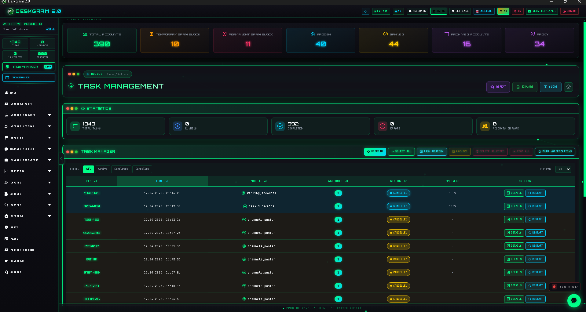
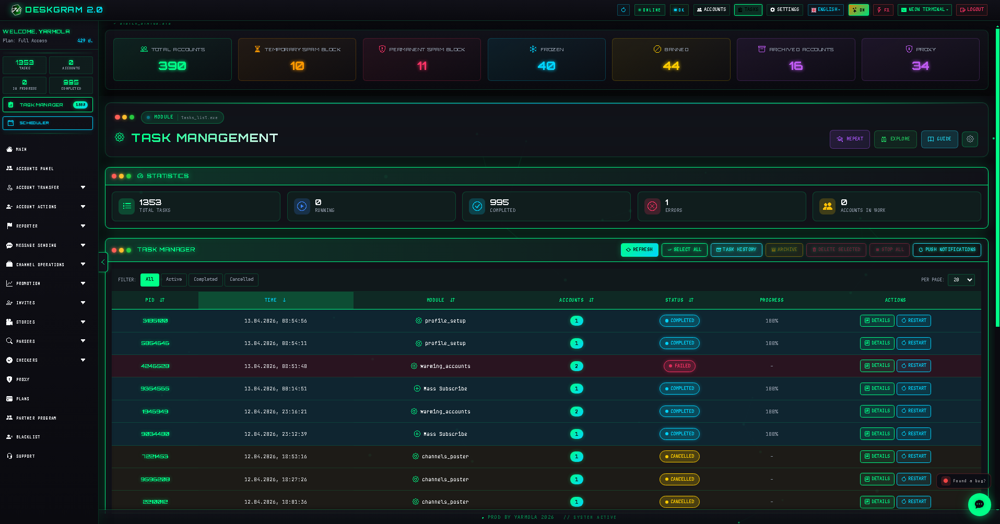
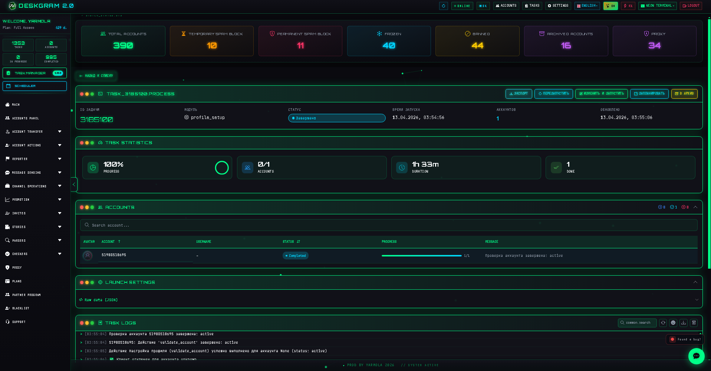

# Telegram Task Manager with Deskgram 2

Task Manager is the Deskgram 2 dashboard for monitoring active and completed Telegram automation processes. It brings task tables, filters, statuses, statistics, and quick control actions into one operational view.

[Deskgram 2 Hub](https://github.com/Deskgram-2/deskgram-2-telegram-automation-en) | [Website](https://deskgram2.com/) | [Telegram Bot](https://t.me/DG2welcomebot) | [Web Preview](https://deskgram2.com/web-preview)
## Interactive Web Preview

Try the module interface in the browser: [Open web preview](https://deskgram2.com/app-demo/tasks)

Task scheduler: [Open scheduler](https://deskgram2.com/web-preview?path=%2Fapp-demo%2Fscheduler)

## About the section

| Parameter | What is inside |
|---|---|
| Main task | Central monitoring of Telegram automation tasks |
| Useful for | Multi-module operations and daily workflow control |
| Core actions | Filters, task review, status tracking, quick actions |
| Important value | One dashboard for active and completed processes |
| Related sections | Neuro Commenting, Direct Messaging, Account Manager |

## What it can do

- show a shared table of running and completed tasks;
- provide quick visibility into statuses and results;
- help track errors and stuck scenarios;
- support filtering and task-level actions;
- keep operational monitoring in one place.

## Quick start

1. Open the task table after launching automation workflows.
2. Review the dashboard for active and completed processes.
3. Use filters to focus on the needed subset of tasks.
4. Open history or stop problematic scenarios when needed.

## Which workflows this page naturally controls

- [Neuro Commenting](https://github.com/Deskgram-2/telegram-neuro-commenting-deskgram-en), when you need visibility into AI comment activity;
- [Direct Messaging](https://github.com/Deskgram-2/telegram-direct-messaging-deskgram-en), when outreach runs across multiple accounts;
- [Audience Parser](https://github.com/Deskgram-2/telegram-audience-parser-deskgram-en), when parsing jobs run in parallel;
- [Invite Tool](https://github.com/Deskgram-2/telegram-invite-tool-deskgram-en), when invite progress and failures must stay visible;
- [Join Groups](https://github.com/Deskgram-2/telegram-join-groups-deskgram-en), when account activity workflows need operational monitoring.

## Interface highlight

### Main task table

### Statistics dashboard

### Task card

## When it is especially useful

- when several modules are running at the same time;
- when operators need to understand what is happening right now;
- when errors and stalled scenarios must be noticed quickly;
- when daily operations depend on constant task visibility.

## Why it is more convenient than manual monitoring

| Manual approach | Task Manager in Deskgram 2 |
|---|---|
| Statuses are scattered across different windows | There is one dashboard and task table |
| It is hard to estimate current workload | The section shows a central operational view |
| History and active scenarios feel disconnected | Monitoring is centralized |
| Problem tasks take longer to isolate | Quick task-level control is built in |
| Errors are easy to miss | Status visibility is part of the workflow |

## Use cases

- controlling parallel campaigns when [Audience Parser](https://github.com/Deskgram-2/telegram-audience-parser-deskgram-en), [Direct Messaging](https://github.com/Deskgram-2/telegram-direct-messaging-deskgram-en), and [Invite Tool](https://github.com/Deskgram-2/telegram-invite-tool-deskgram-en) run together;
- watching AI-heavy flows like [Neuro Commenting](https://github.com/Deskgram-2/telegram-neuro-commenting-deskgram-en), where fast error detection matters;
- monitoring the execution layer after the infrastructure is already prepared;
- giving a team one operational control point when multiple Deskgram 2 workflows run in parallel.

## What to choose: Task Manager or Account Manager

| If your goal is | Better fit |
|---|---|
| See which workflows are running and what state they are in | `Task Manager` |
| Build the account subset for a new scenario | [Account Manager](https://github.com/Deskgram-2/telegram-account-manager-deskgram-en) |
| Stop a problematic process and review history | `Task Manager` |
| Manage the account base rather than execution | [Account Manager](https://github.com/Deskgram-2/telegram-account-manager-deskgram-en) |

## Related repositories

- [Deskgram 2 Hub](https://github.com/Deskgram-2/deskgram-2-telegram-automation-en)
- [Neuro Commenting](https://github.com/Deskgram-2/telegram-neuro-commenting-deskgram-en)
- [Direct Messaging](https://github.com/Deskgram-2/telegram-direct-messaging-deskgram-en)
- [Account Manager](https://github.com/Deskgram-2/telegram-account-manager-deskgram-en)
- [Audience Parser](https://github.com/Deskgram-2/telegram-audience-parser-deskgram-en)
- [Invite Tool](https://github.com/Deskgram-2/telegram-invite-tool-deskgram-en)
- [Join Groups](https://github.com/Deskgram-2/telegram-join-groups-deskgram-en)

## FAQ

### Why use this if modules already show their own progress?

Because the task dashboard gives you one operational picture across modules instead of forcing you to jump between screens.

### When is it most useful?

Whenever multiple Telegram scenarios are running in parallel.
